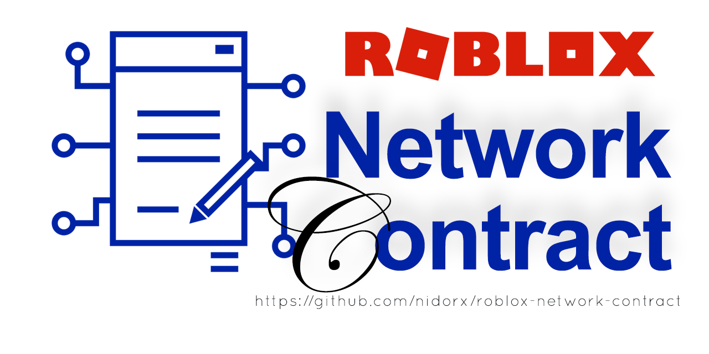
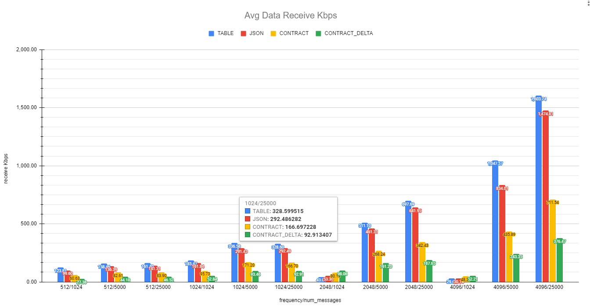
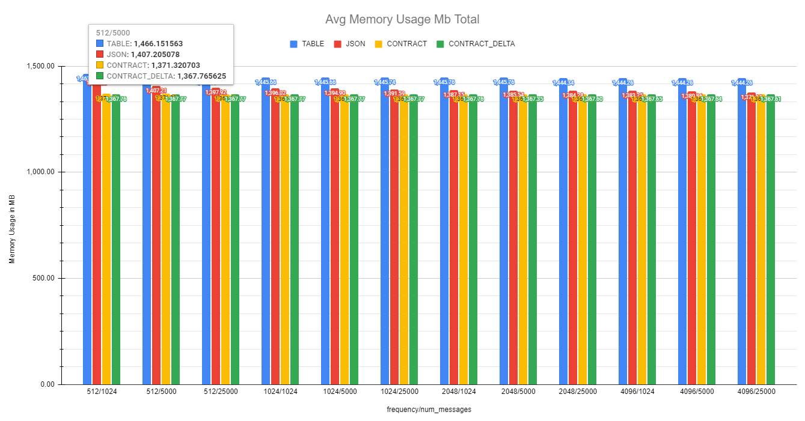
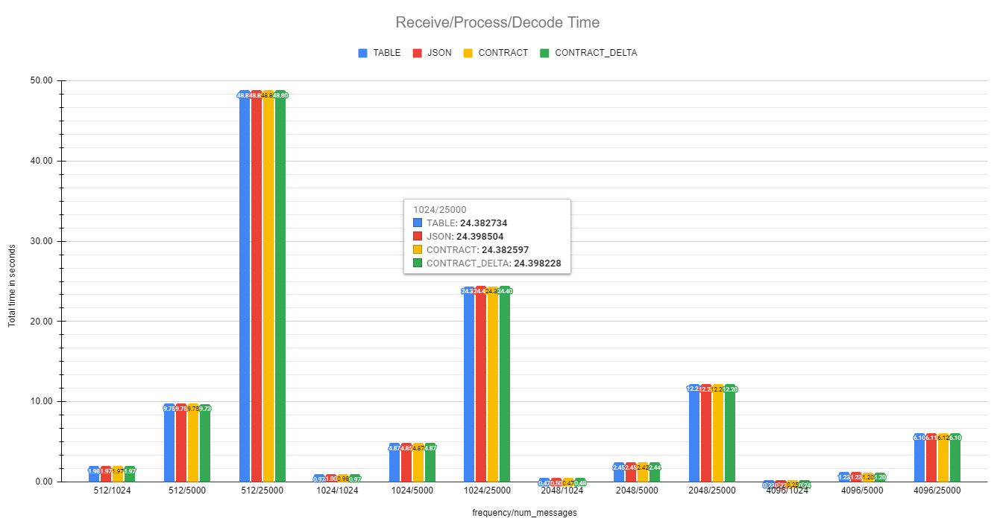
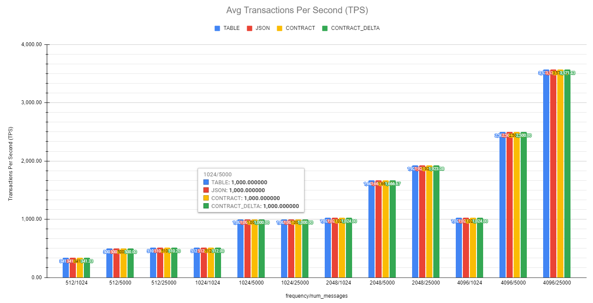
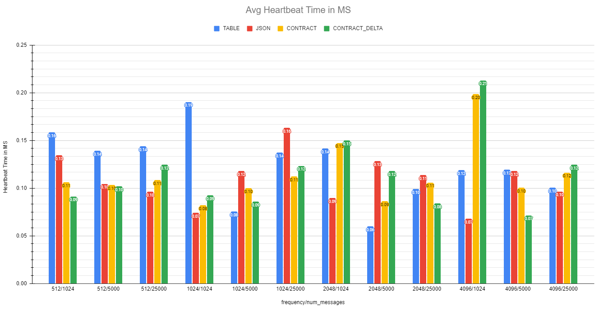

**Roblox Network Contract** facilitates Client Server communication through Events. Has Encode, Decode, Diff, Patch and Message Knowledge


**TLDR;**
```lua
local Contract = NetworkContract(1, {
   'PositionX',
   'PositionZ',
   'Ammo',
   'Health',
   'Armor',
   'Alive',
   'UserId'
}, function(data, id, isDelta, player, contract)

   local player
   if isDelta then
      -- Patch (delta changes)
      player = contract.Patch(oldObject, data)
   else
      -- full object
      player = contract.Decode(data)
   end
   -- your logic ...
   
end)

-- send full object or just changes (diff)
Contract.Send(Contract.Encode(PlayerData))
Contract.Send(Contract.Diff(PlayerData, ChangedValues))
```

## Links

- **Latest stable version**
   - https://www.roblox.com/library/6028467418/NetworkContract
- **Forum**
   - https://devforum.roblox.com/t/900276
- **Benchmark place**
   - https://github.com/nidorx/roblox-network-contract/blob/main/Benchmark.rbxl

## Installation

You can do the installation directly from Roblox Studio, through the Toolbox search for `NetworkContract`, this is the minified version (https://www.roblox.com/library/6028467418/NetworkContract).

If you want to work with the original source code (for debugging or working on improvements), access the repository at https://github.com/nidorx/roblox-network-contract

## What is NetworkContract

NetworkContract is a module for Roblox that facilitates Client-Server communication through RemoteEvent.

NetworkContract has the following characteristics:

- Assists in the definition of consistent contracts between Client and Server
- Simplifies confirmation of message reception by the other party (automatically or manually)
- Allows the exchange of messages using [Delta Encoding](https://en.wikipedia.org/wiki/Delta_encoding) (Diff). With Diff, you only transport object changes
- Drastic reduction in network consumption with zero impact on processing time and memory consumption (average of more than 200% with respect to sending simple messages and more than 180% with respect to sending JSON), see topic **Performance & Benchmark** below

## How to use NetworkContract

NetworkContract works with the concept of contracts. A contract defines which attributes will be transported in the Client Server integration.

### Define a contract

The `NetworkContract` method has the following signature:

`NetworkContract(id, attributes, OnMessage, OnAcknowledge, AutoAcknowledge)`

Where:
   - **`id`** _`{Number|String}`_ : Unique contract identifier, used to create `RemoteEvent` on the server side
   - **`attributes`** _`{String[]}`_ : List with the attributes of the contract, maximum limit of 32 items (see topic Limitations). To increase performance during encode and decode, it is important that the attributes that suffer the most changes are at the beginning of the list, and the most static items at the end of the list.
   - **`OnMessage`** _`{Function(data, id, isDelta, player, contract)}`_ : Called whenever a party receives a message. The `player` parameter is `nil` when using the contract on the client side.
      > **IMPORTANT!** Received data can be null it is important that the developer validate before using
   - **`OnAcknowledge`** _`{Function(id, player, contract)}`_ _`(optional)`_ : Called whenever you receive a confirmation message from the other party
   - **`AutoAcknowledge`** _`{bool} default true`_ _`(optional)`_ : When `true` and the received message has an ID, NetworkContract responds immediately with a confirmation message. To remove this behavior, just enter `false` in this parameter. To send a manual confirmation message, use the `Acknowledge` method of the contract instance

The contract instance created by `NetworkContract` has the following methods:

- **`Encode(object)`** : Encodes an object to be transmitted.
- **`Decode(data)`** : Decodes an object received over the network. Generally used within the contract's `OnMessage` method when`isDelta == false`
- **`Diff(oldObject, changedObject)`** : It encodes an object (generating a diff, or delta encode), returning only those attributes that have been modified, added or removed. This is the best format for transmitting your data
- **`Patch(oldObject, delta)`** : Decodes a delta encode (diff) applying the changes to the informed object. This method returns a new object, does not modify the `oldObject`
- **`Send(data, id)`** : Transmits an encoded object
- **`Acknowledge(id)`** : When `AutoAcknowledge == false`, you can send a confirmation message using this method

```lua
local NetworkContract = require(game.ReplicatedStorage:WaitForChild('NetworkContract'))

local MyContract = NetworkContract(1, { 'Attr1', 'Attr2' }, function(data, id, isDelta, player, contract)

   local object
   if isDelta then
      object = contract.Patch(MyOldObject, data)
   else
      -- full object
      object = contract.Decode(data)
   end
   -- your logic ...
   
end, function(id, player, contract)
   -- do something with messageId
end)
```

> **ATTENTION!** The same contract must be created in the Client and Server part, so it is interesting that your contracts are in a `ModuleScript` to be imported. The Server side creates the `RemoteEvent` when instantiating a contract

From the contract instance you can send messages using the `Send` method. Before sending the data, you need to encode it using the `Encode` method or, if you only want to transmit the changes, the `Diff` method. The `Send` method does not validate the received data, it is the responsibility of the developer (you) to perform such validation

```lua
local messageId = 1

local MyObject  = {
   Attr1 = 33.54,
   Attr2 = 'xpto'
}

-- Will send the complete object
MyContract.Send(MyContract.Encode(MyObject), messageId)

local MyObjectChanged  = {
   Attr1 = 77.987,
   Attr2 = 'xpto'
}
-- It will only send the attribute 'Attr 1', which has changed
MyContract.Send(MyContract.Diff(MyObject, MyObjectChanged))
```

Note that in the second call we do not enter the `messageID`, so the other party will not send a confirmation message when receiving the message.


## Limitations

1. **Number of attributes**: The maximum number of attributes that a contract can have on NetworkContract is 32. To reduce the size of the object being trafficked on the network, NetworkContract makes use of [Bit field](https://en.wikipedia.org/wiki/Bit_field) to determine the indexes of the object's attributes.
2. **Floating point comparison**: For Diff encoding, NetworkContract performs an [approximate comparison](https://floating-point-gui.de/errors/comparison/), using 0.00001 _(aka 1e-5)_ as precision _(EPSILON)_. That said, if the difference in a numeric attribute is less than EPSILON, the data is considered equal, so the diff will not consider this value. To remove this behavior, modify the `Diff` method in the source code, removing the call to the `FuzzyEqNumber` function
3. **Complex objects**: It is not recommended to use complex objects in NetworkContract (where the attributes are Table). Although it is possible to use complex objects, the `Encode` and `Diff` methods will not perform recursive processing, therefore, they will not reduce the size of the object to be transported over the network

## Performance & Benchmark

The main objective of NetworkContract is to provide a solution to reduce network traffic with minimal impact on processing and memory consumption. In order to achieve this objective, NetworkContract implements a relatively simple coding model, it basically only transports the values of objects and all keys are mapped into a single Integer through bit manipulation. The same concept is applied to the Diff.

An encoded NetworkContract object has the following format: `{TRUE, BITMASK, VALUE_N ...}`

Where:
- **`TRUE`**: Always true, to differentiate from a Diff
- **`BITMASK`**: All the ids of the attributes being transported, in a single Integer
- **`VALUE_N...`** : All values being transported, sorted and mapped by BITMASK

A NetworkContract delta encode (Diff) has a similar signature, the only differences being `false` at the beginning and an additional `BITMASK` to register the removed attributes: `{FALSE, BITMASK_DEL, BITMASK_MOD, VALUE_N ...}`


### Benchmark

In order to validate the performance of the solution, a Benchmark was performed, comparing the following options for exchanging messages via `RemoteEvent`

1. **Table** : Simple object without coding
2. **JSON** : Encode and decode the object using the `HttpService: JSONEncode` and `HttpService: JSONDecode` methods
3. **NetworkContract without Diff** : Sending the object using only the NetworkContract's `Encode` and `Decode` method
4. **NetworkContract with Diff** : Sending delta encode using NetworkContract's `Diff` and `Patch` methods

For each of the models above, 12 load tests were performed, with the crossing of the parameters below

1. **Frequency** : Number of messages sent per second
   - 512, 1024, 2048, 4096
2. **Number of messages** : Total number of messages sent in a test
   - 1024, 5000, 25000

The test consisted of sending several calls to the client from the server. The execution of the calls was organized in batches, grouped by Frequency and Number of messages. At the end of each round, the client summarizes the results and prints on the output.

After the execution of all tests, the data was copied from the Roblox Studio output, transferred to Notepad++ in order to remove the indentation and finally pasted into [Google Sheets](https://docs.google.com/spreadsheets/d/1I_pl2bHMXUr5gLFHZupkpU2roJvVsAJzvWJuaEPdy8M/edit?usp=sharing) to generate the analytical graphs.

On the client side, the following indicators were captured every second

1. **Transactions Per Second (TPS)** : Number of messages received per second
2. **Data Receive Kbps**: [DataReceiveKbps](https://developer.roblox.com/en-us/api-reference/property/Stats/DataReceiveKbps) describes roughly how many kilobytes of data are being received by the current instance, per second.
2. **Heartbeat Time in Ms**: The [HeartbeatTimeMs](https://developer.roblox.com/en-us/api-reference/property/Stats/HeartbeatTimeMs)  property is a a measurement of the total amount of time it takes long it takes for Roblox to update all of its Task Scheduler jobs, in milliseconds. If this value is high, then it means one of the tasks are hogging up a lot of resources.
2. **Total Memory Usage in Mb**: [GetTotalMemoryUsageMb](https://developer.roblox.com/en-us/api-reference/function/Stats/GetTotalMemoryUsageMb) is the total amount of memory being consumed by the current game session, in megabytes.

Additionally, the system recorded the total time for receiving and processing the message

> The results below were obtained on a Dell Inspiron 15 7572, Intel(R) Core(TM) i7-8550U, 16.0 GB Ram, Windows 10 x64 notebook. Debug Mode has been disabled in Roblox Studio.

#### Data Receive Kbps

The most expressive result in the use of NetworkContract is in the reduction of data traffic. In the graph below it is possible to see an average reduction of more than 200% when comparing the delta encode with Table and more than 180% in relation to JSON transport.

Even when delta encode is not used, NetworkContract performance is on average 100% better than simple data transport (Table)



#### Total Memory Usage in Mb

The amount of total memory used had a considerable decrease during the tests with NetworkContract, looking at the graph, it is possible to notice that Roblox consumes a lot of memory to perform the internal encode and decode (used in events). A strong indication of this is the fact that NetworkContract generates simpler tables, reducing the consumption used internally by Roblox. Note that even JSON-encoded data consumes less memory than using simple tables :|



#### Processing time & TPS

The total processing time and Transactions Per Second (TPS) remained constant in all tests performed



 

#### Heartbeat Time in Ms

The analysis of the `HeartbeatTimeMs` statistic is not consistent, at various times the NetworkContract performs well and in other scenarios it presents bad values.

> I am checking if the use of this indicator is correct, this result is repeated in all experiments



## Feedback, Requests and Roadmap

Please use [GitHub issues] for feedback, questions or comments.

If you have specific feature requests or would like to vote on what others are recommending, please go to the [GitHub issues] section as well. I would love to see what you are thinking.

## Contributing

You can contribute in many ways to this project.

### Translating and documenting

I'm not a native speaker of the English language, so you may have noticed a lot of grammar errors in this documentation.

You can FORK this project and suggest improvements to this document (https://github.com/nidorx/roblox-network-contract/edit/master/README.md).

If you find it more convenient, report a issue with the details on [GitHub issues].

### Reporting Issues

If you have encountered a problem with this component please file a defect on [GitHub issues].

Describe as much detail as possible to get the problem reproduced and eventually corrected.

### Fixing defects and adding improvements

1. Fork it (<https://github.com/nidorx/roblox-network-contract/fork>)
2. Commit your changes (`git commit -am 'Add some fooBar'`)
3. Push to your master branch (`git push`)
4. Create a new Pull Request

## License

This code is distributed under the terms and conditions of the [MIT license](LICENSE).


[GitHub issues]: https://github.com/nidorx/roblox-network-contract/issues
